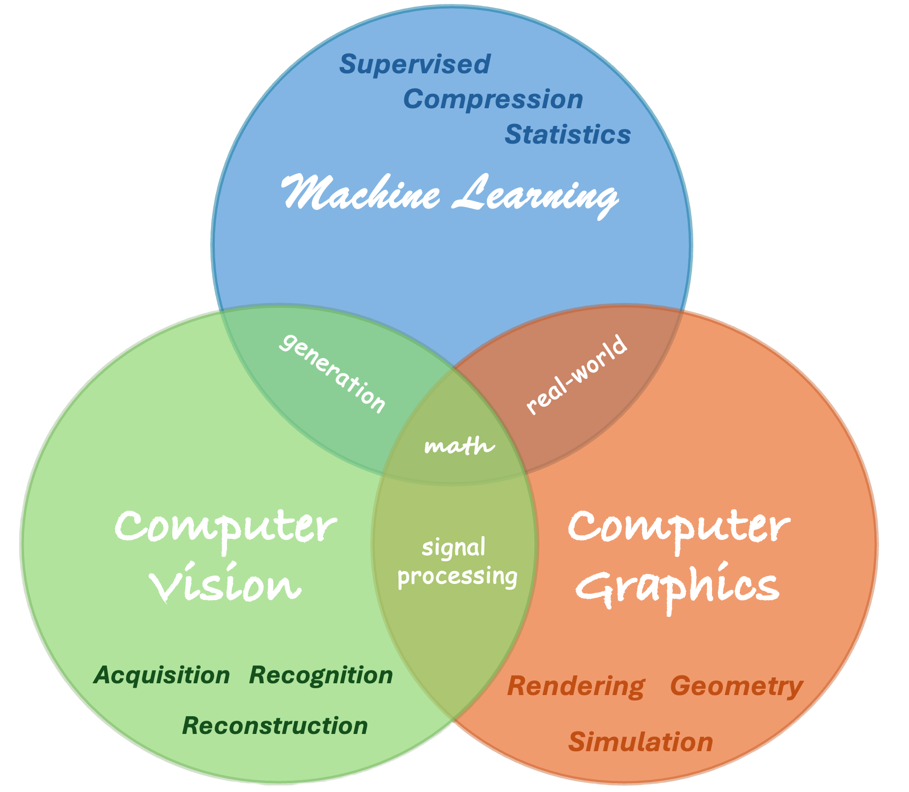

# Visual Computing

A collection of my *Visual Computing Projects*, including

- Graphics
- Vision
- Signal Processing / Image Processing
- Compression
- Game Engines and others.

| I\O                 | Image             | Knowledge                |
| ------------------- | ----------------- | ------------------------ |
| **Image**     | Image Processing  | Computer Vision          |
| **Knowledge** | Computer Graphics | Aritificial Intelligence |

In addition, there are also references (paper, ebook, repo, tool, etc) that's interesting and helpful, ranging from beginner to advanced.

## My Projects

### Graphics and Rendering

[MIT6.837-Computer-Graphics-Fall2004](https://github.com/PeterHUistyping/MIT6.837-CG-Fall2004-Assignment)

- *Computer Graphics, MIT6.837, C++ / OpenGL*
  - Self-similar Fractals
  - Ray Tracer, Graphics Pipeline
  - Voxel rendering, Super sampling
  - Acceleration Structure, Grid, k-d tree, BVH
  - and more ...

### Computer Vision

*Theoretical Computer Vision with Problems Sets, Stanford CS231n*

[DL-for-CV-Stanford_CS231n](https://github.com/PeterHUistyping/Stanford_CS231n-Deep_Learning-for-Computer_Vision/)

- Image Classification (Supervised Learning, Discrete label)
  - kNN
  - Softmax
  - classifier SVM classifier
  - CNN
  - Cross Validation

### Compression

[LZSS on 3D Data @UKTechArena](https://github.com/PeterHUistyping/UKTechArena-3D_Graphics_Compression_Algorithm-Metaverse)

- 6-level LZSS Compression with Serialisation, Delta Coding, Huffman Coding
- [LZSS with Demo](https://github.com/PeterHUistyping/LZSS_with_Concurrent_Demo)

## Reference

### Discrete Differential Geometry

[CMU15-458_DDG](https://github.com/PeterHUistyping/CMU15-458_Differential_Geometry)

- Exterior Calculus
- Smoothing Surface / Curve
- Laplace operator
- Parameterization

### Digital Signal Processing

[DSP @ Cambridge part II](https://www.cl.cam.ac.uk/teaching/2324/DSP/)

- Convolution, Deconvolution
- FT, DFT, FFT
- Z-transform, Laplace transform
- Digital Filters
- PCA / K-L transform
- JEPG (DCT, Quantization, Compression)
  
### Advanced Graphics and Image Processing

[AGIP @ Cambridge part II](https://www.cl.cam.ac.uk/teaching/2324/AGIP/)

- Convolution, Filter (edge-aware)
- Ray Tracing, BRDF, GI
- Light-field rendering
- NeRF
- Color, Image Quality
- VR/AR
- 
### Game Engine

[👨‍💻Unreal Engine](https://www.unrealengine.com/en-US)
Source code: https://docs.unrealengine.com/5.2/en-US/downloading-unreal-engine-source-code/

### Physically Based Rendering (PBR)

[📖PBR_Online Ebook](https://www.pbr-book.org/)
Matt Pharr, Wenzel Jakob, and Greg Humphreys
